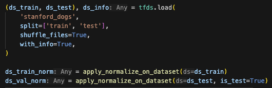

🔑 **PRT(Peer Review Template)**  
(Reviewer: 권영찬)
코드작성자: 손영철

- [x]  **1. 주어진 문제를 해결하는 완성된 코드가 제출되었나요? (완성도)**
    - 문제에서 요구하는 최종 결과물이 첨부되었는지 확인
    - 문제를 해결하는 완성된 코드란 프로젝트 루브릭 3개 중 2개, 
    퀘스트 문제 요구조건 등을 지칭
        - 해당 조건을 만족하는 부분의 코드 및 결과물을 캡쳐하여 사진으로 첨부
    1. CAM을 얻기 위한 기본 모델의 구성과 학습 진행
        
    2. 분류근거를 설명 가능한 class activation map으로 구현
          
    3. 인식결과의 시각화 및 성능 분석
          
          

- [ ]  **2. 프로젝트에서 핵심적인 부분에 대한 설명이 주석(닥스트링) 및 마크다운 형태로 잘 기록되어있나요? (설명)**
    - [x]  모델 선정 이유
        class activation map 을 구현하기 위한 모델 선정
    - [x]  Metrics 선정 이유
        분류 태스크의 Accuracy 선정
    - [ ]  Loss 선정 이유

- [ ]  **3. 체크리스트에 해당하는 항목들을 모두 수행하였나요? (문제 해결)**
    - [x]  데이터를 분할하여 프로젝트를 진행했나요? (train, validation, test 데이터로 구분)
        
    - [ ]  하이퍼파라미터를 변경해가며 여러 시도를 했나요? (learning rate, dropout rate, unit, batch size, epoch 등)
    - [x]  각 실험을 시각화하여 비교하였나요?
        
        
    - [x]  모든 실험 결과가 기록되었나요?
          
        

- [ ]  **4. 프로젝트에 대한 회고가 상세히 기록 되어 있나요? (회고, 정리)**
    - [ ]  배운 점
    - [ ]  아쉬운 점
    - [ ]  느낀 점
    - [ ]  어려웠던 점