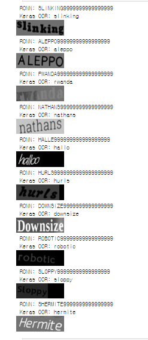

🔑 **PRT(Peer Review Template)**
- 코더: 손영철
- 리뷰어: 신재현

- [X]  **1. 주어진 문제를 해결하는 완성된 코드가 제출되었나요? (완성도)**
    - 문제에서 요구하는 최종 결과물이 첨부되었는지 확인
    - 문제를 해결하는 완성된 코드란 프로젝트 루브릭 3개 중 2개, 
    퀘스트 문제 요구조건 등을 지칭
        - 해당 조건을 만족하는 부분의 코드 및 결과물을 캡쳐하여 사진으로 첨부

- [ ]  **2. 프로젝트에서 핵심적인 부분에 대한 설명이 주석(닥스트링) 및 마크다운 형태로 잘 기록되어있나요? (설명)**
    - [ ]  모델 선정 이유
    해당 사항 없습니다.
    - [ ]  Metrics 선정 이유
    해당 사항 없습니다.
    - [ ]  Loss 선정 이유
    해당 사항 없습니다.
    위 3 요소들은 OCR 모델을 처음부터 구현하는 것이 아닌 기존 패키지 및 옛날 모델들을 사용하는 부분들이 많아 따로 해당 사항 없습니다.

- [ ]  **3. 체크리스트에 해당하는 항목들을 모두 수행하였나요? (문제 해결)**
    - [X]  데이터를 분할하여 프로젝트를 진행했나요? (train, validation, test 데이터로 구분)
    - [ ]  하이퍼파라미터를 변경해가며 여러 시도를 했나요? (learning rate, dropout rate, unit, batch size, epoch 등)
    - [X]  각 실험을 시각화하여 비교하였나요?
    아내 내용처럼 직관적으로 두 모델간 비교를 진행하였습니다.
    - [X]  모든 실험 결과가 기록되었나요?
    모든 실험 결과들이 각 ipynb 결과물 정도 기록되어 있습니다.

- [ ]  **4. 프로젝트에 대한 회고가 상세히 기록 되어 있나요? (회고, 정리)**
    - [ ]  배운 점
    - [ ]  아쉬운 점
    - [ ]  느낀 점
    - [ ]  어려웠던 점

안의 내용을 자세히 보시면 두 모델들간의 정확도를 비교해서 시각화 한 요소들을 볼 수 있습니다.